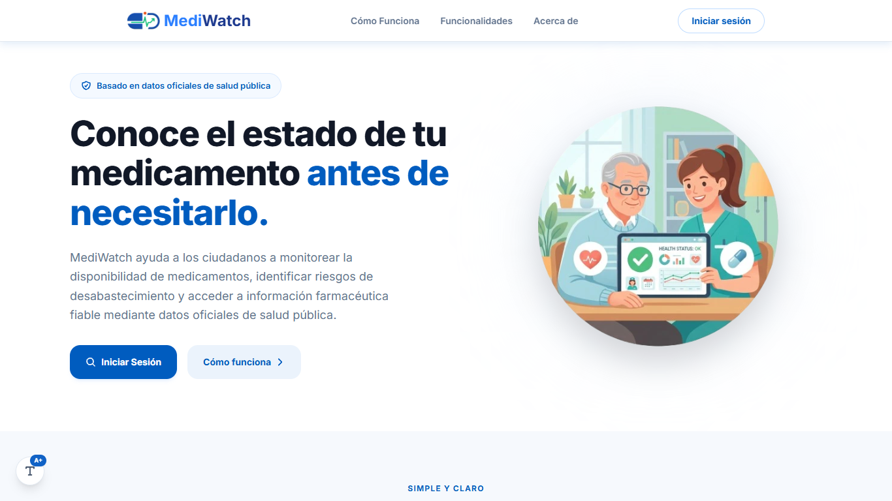
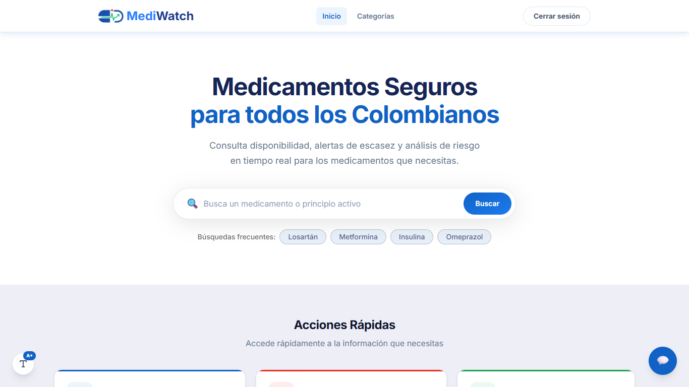
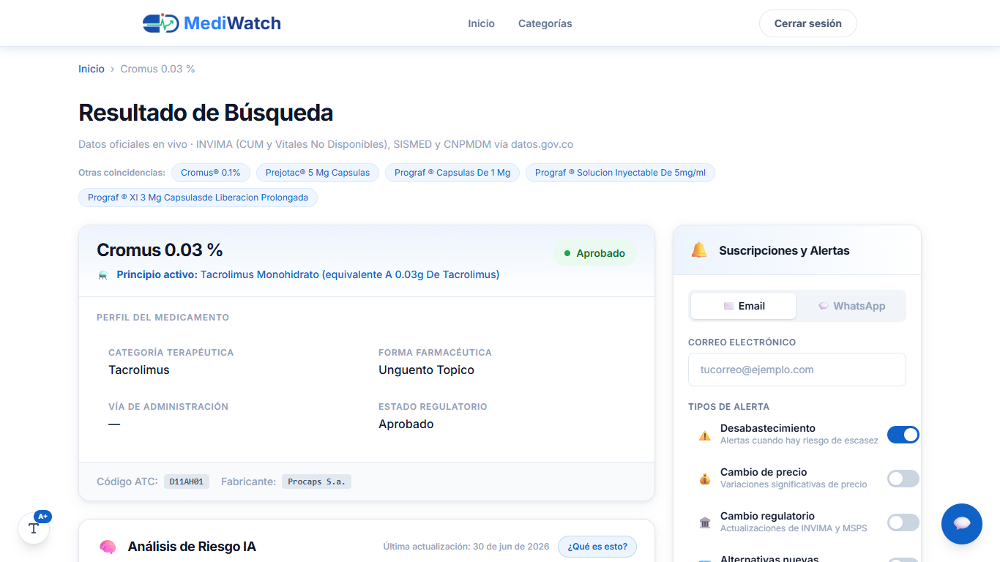
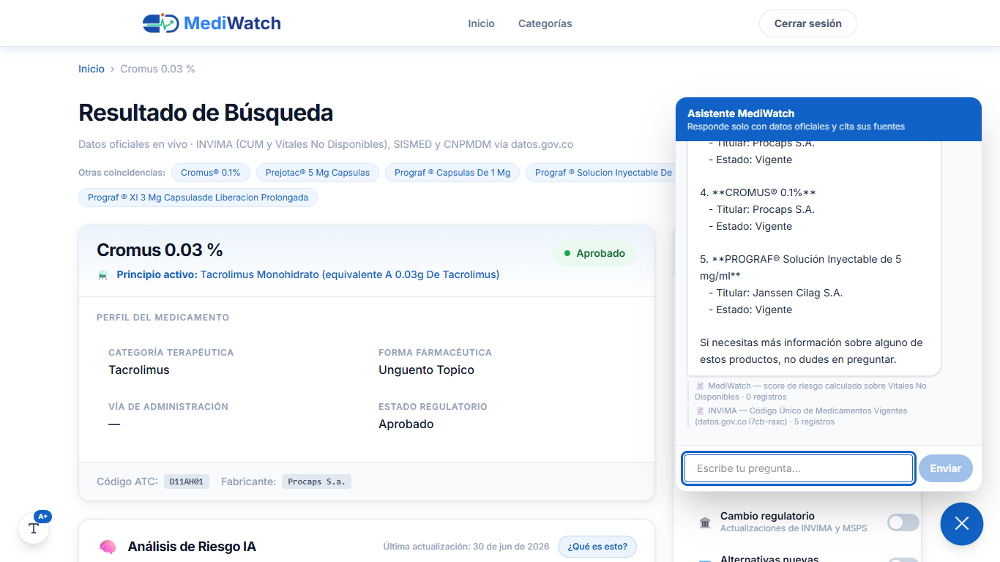

# 💊 MediWatch

### Plataforma de IA para monitorear disponibilidad, riesgo de desabastecimiento y precios de medicamentos en Colombia

**Proyecto del reto de salud — "Datos al Ecosistema 2026: Inteligencia Artificial para Colombia" (Nivel Avanzado)**

---

## Problema abordado

El desabastecimiento de medicamentos vitales afecta a pacientes, IPS y tomadores de decisión en Colombia. La información oficial existe (INVIMA, MinSalud, CNPMDM) pero está fragmentada en datasets separados y sin llaves comunes, lo que impide anticipar riesgos y comparar precios.

## Justificación (valor público)

MediWatch integra 4 fuentes oficiales de datos.gov.co en una sola plataforma consultable por cualquier ciudadano, con un score de riesgo de desabastecimiento interpretable, precios de referencia y un asistente conversacional con trazabilidad a los registros originales.

## Datasets utilizados (4 — todos de datos.gov.co)

| # | Dataset | Resource ID | Filas | Uso |
|---|---------|-------------|-------|-----|
| 1 | Código Único de Medicamentos Vigentes (INVIMA) | `i7cb-raxc` | ~157.000 | Catálogo maestro |
| 2 | Medicamentos Vitales No Disponibles (INVIMA) | `sdmr-tfmf` | ~10.500 | Motor del score de riesgo |
| 3 | SISMED — precios (compactado con Spark de ~23M a 3,7M filas) | histórico 2017-2019 | 3.685.617 | Histórico de precios |
| 4 | Precios Máximos de Venta por CUM (CNPMDM, Circular 19/2024) | `nauz-qkjw` | ~38.600 | Precio techo vigente |

Datasets externos: no aplica.

## Variables seleccionadas

20 variables documentadas en [docs/diccionario_datos.md](docs/diccionario_datos.md).

## Tipo de análisis

Predictivo (clasificación) + descriptivo. **Modelo:** score compuesto interpretable 0–100 (pesos documentados en [config/risk_model_params.yaml](config/risk_model_params.yaml)) + **regresión logística** de validación con backtest temporal.

## Resultados clave

- **AUC promedio 0,787 · precision@20 = 0,988** en backtest temporal de 4 cortes ([models/predictive/metrics.json](models/predictive/metrics.json); matriz de confusión y ROC en [reports/figures/](reports/figures/)).
- **591 principios activos con score** de riesgo (155 en nivel alto/crítico al corte 2026-04); el riesgo se concentra en medicamentos huérfanos y en esenciales como la lidocaína (89,7).
- Integración sin llave directa (IUM 100% vacío): cascada exacto → fuzzy → componentes cubre 27,5% de los PAs y 32,4% de las solicitudes ([reports/metricas_integracion.json](reports/metricas_integracion.json)); el "sin match" restante refleja el fenómeno mismo (vitales sin registro vigente).
- **Precios integrados para el 63% del catálogo** (el regulado solo cubre 30%); hallazgo: el 37% de los productos vigentes no tiene ningún dato público de precio.
- **Predicción de ML en producción**: cada medicamento muestra la probabilidad de nuevas solicitudes de escasez en los próximos 3 meses, calculada por la regresión logística validada (no solo documentada: visible en la app y consultable por el asistente).
- 36+ tests en CI (unitarios + integración + **bias tests**) y suite E2E de navegador real con agent-browser; pipeline completo reproducible en ~3 minutos.

## Interpretación · Impacto potencial · Limitaciones

Ver [docs/conclusiones.md](docs/conclusiones.md) y [docs/public_impact_assessment.md](docs/public_impact_assessment.md).

## 🚀 Solución en Producción (Demo en Vivo)

- **Aplicación Web:** https://respectful-appreciation-production.up.railway.app
- **Documentación de la API (Swagger):** https://283-proyecto-abierto-ia-production.up.railway.app/docs

### Capturas

| | |
|---|---|
|  |  |
|  |  |

## 📚 Documentación

- **[Informe Técnico (PDF)](docs/informe_tecnico.pdf)** — desarrollo, métricas y resultados
- **[Manual de Usuario (PDF)](docs/manual_usuario.pdf)** — guía paso a paso de la plataforma
- **[Diagrama de Arquitectura](docs/architecture/arquitectura_sistema.png)** · [architecture.md](docs/architecture.md)
- [Planteamiento del problema](docs/planteamiento_problema.md) · [Marco metodológico CRISP-ML(Q)](docs/marco_metodologico.md) · [Fuentes de datos](docs/fuentes_datos.md) · [Guía de validación para pares](docs/validation_guide.md) · [Guía de despliegue](docs/despliegue.md)

## Reproducir localmente

```bash
pip install -r requirements.txt
# credenciales en .env (ver .env.example)
python -m src.data_pipeline.run_all        # pipeline completo: ingesta → limpieza → integración → carga
python -m pytest tests/ -v                 # tests
```

## Enlaces de acceso

- [Descargar presentación (.PPTX)](RECURSOS/Presentacion.pptx) *(día 4)*
- [Ver presentación en línea (.PDF)](RECURSOS/presentacion.pdf) *(día 4)*

## Equipo

| Nombre | Rol |
|--------|-----|
| Tatiana | Data / Backend / Coordinación |
| Liliana Forero | Frontend / UI-UX |
| Integrante 3 | Data Engineering (compactación Spark SISMED) |

## Licencia

MIT — ver [LICENSE](LICENSE).
