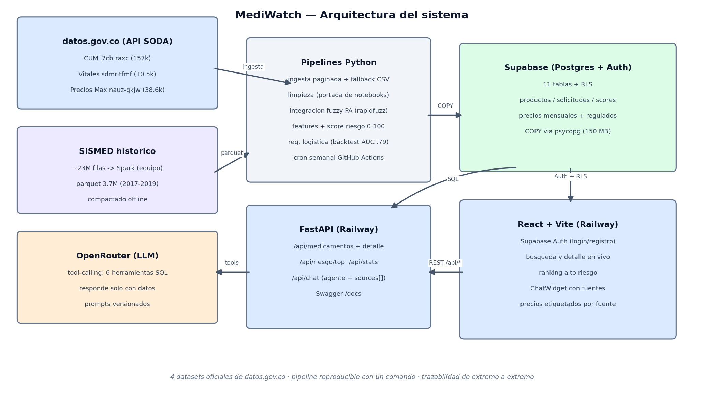

# Arquitectura del sistema

## Componentes

| Componente | Tecnología | Responsabilidad |
|------------|-----------|-----------------|
| Ingesta | Python + API SODA | Descarga paginada de 3 datasets en vivo con fallback a snapshots CSV |
| Big Data (offline) | Apache Spark (equipo) | Compactación del SISMED: ~23M → 3,7M filas (evidencia: part-files en `data/external/`) |
| Pipeline | pandas + rapidfuzz | Limpieza portada de los notebooks, integración fuzzy, features, carga |
| Modelo | scikit-learn | Score compuesto 0-100 interpretable + regresión logística de validación (backtest temporal) |
| Base de datos | Supabase (Postgres) | 11 tablas con RLS; carga masiva COPY vía psycopg |
| API | FastAPI | REST + Swagger; búsqueda unaccent; detalle integrado de 4 fuentes |
| Agentes IA | OpenRouter (tool-calling) | citizen_agent (chat con 6 herramientas SQL y sources[]) + analyst_agent (aiInsight y reportes) |
| Frontend | React 19 + Vite + Tailwind | Supabase Auth, búsqueda/detalle en vivo, ranking de riesgo, ChatWidget |
| Automatización | GitHub Actions | CI (tests en cada push) + re-ingesta semanal + evaluación mensual del modelo (drift) |
| Despliegue | Railway + Docker | 2 servicios (API + frontend estático); ver `despliegue.md` |

## Decisiones de diseño clave

1. **Retrieval estructurado (SQL) en vez de embeddings** para el asistente: los datos son tabulares con cifras exactas; el SQL es más preciso, más barato y 100% trazable. pgvector queda instalado para la memoria de largo plazo (roadmap).
2. **Score interpretable por diseño** (suma ponderada documentada) validado por un modelo predictivo aparte — explicabilidad sin sacrificar evidencia de capacidad predictiva.
3. **El parquet SISMED no viaja al repo** (230 MB): la app lee el agregado desde Supabase; el pipeline lo omite con gracia si no está.
4. **Pipeline idempotente por tabla**: el cron semanal recrea solo las tablas con datos nuevos; `chat_logs` y `risk_scores` nunca se tumban.
5. **Frontend desacoplado por contrato**: un adaptador (`frontend/src/lib/api.ts`) mapea la API a los tipos originales del prototipo — el equipo de UI no tuvo que reescribir componentes.

## Decisiones de despliegue y operación (por qué así y no de otra forma)

1. **Railway en vez de Kubernetes.** El sistema son 2 servicios sin estado con tráfico de demo; una plataforma administrada los despliega, escala y reinicia sin manifiestos propios. Escribir deployments/HPA de Kubernetes para una app que no corre en Kubernetes sería infraestructura ficticia: preferimos un despliegue real y verificable (URLs públicas en vivo) sobre archivos decorativos. Si el proyecto escalara a k8s, `Dockerfile.api` y `Dockerfile.cron` son las mismas imágenes que usaría un `Deployment` y un `CronJob`.
2. **La tarea programada corre en GitHub Actions** (`data-update-cron.yml`): aporta logs, historial de corridas, reintentos manuales y manejo de secrets sin infraestructura adicional. **`Dockerfile.cron` existe para portabilidad**: encapsula la misma tarea (re-ingesta + recálculo de scores) para cualquier orquestador (Kubernetes CronJob, ECS, cron de un VPS).
3. **Monitoreo de desvío del modelo** (`model_evaluation.yml`): cada mes reentrena con datos frescos de datos.gov.co (sin tocar la base, `--skip-load`), corre el backtest temporal y **falla si el AUC < 0,70 o precision@20 < 0,90** — la falla del workflow es la alerta de drift, y las métricas quedan publicadas como artefactos para auditar la evolución.
4. **Sin `vector_store/`**: el asistente no usa embeddings; su retrieval es SQL estructurada sobre Supabase (ver decisión 1 arriba y `marco_metodologico.md`). Una base vectorial aquí sería complejidad sin función.
